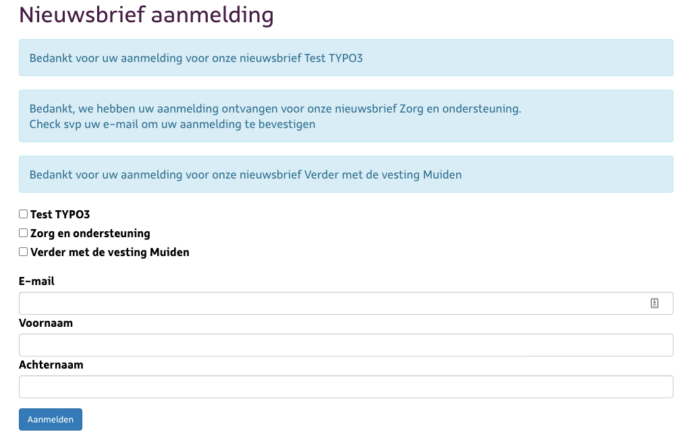

.. include:: ../Includes.txt

.. _installation:

============
Installation
============

Target group: **Administrators**

* composer req proudnerds-typo3/laposta
* include the typoscript template
* add to editor backend user groups
* add the Laposta apiKey in constants settings
* create 'Laposta newsletter list' records
* insert the plugins for subscribe and unsubscribe on pages
* choose the 'Laposta newsletter list' records
* set the records storage page to the page where you keep the 'Laposta newsletter list' records
* on Laposta.nl you can add custom fields for each of your newsletters. In the template are now email (required), voornaam and achternaam
* you can easily change and add custom fields in the template, just put 'customField.' before it and it works
* a log is kept in /var/log/Laposta.log

