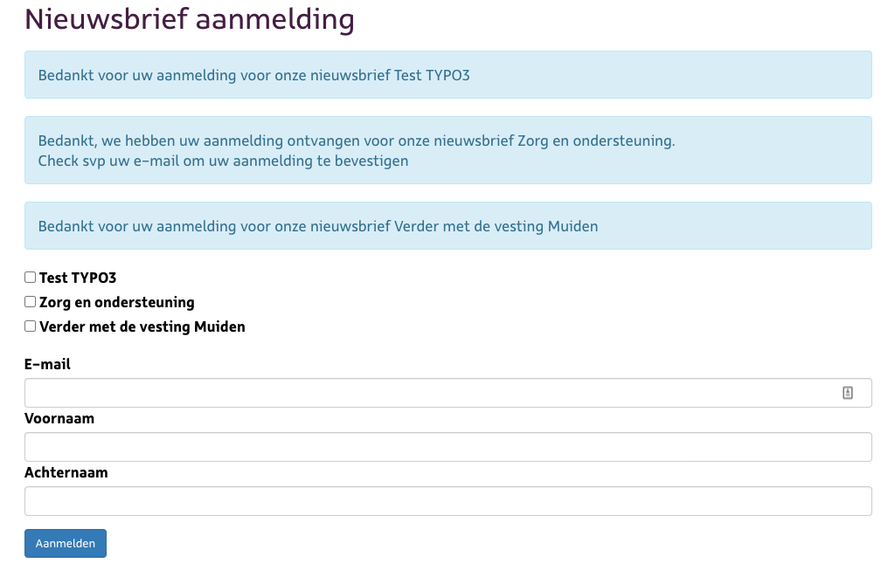

..  _installation:

============
Installation
============

Target group: **Administrators / Integrators**

#.  Install the extension: ``composer require proudnerds/laposta``.
#.  Include the TypoScript template.
#.  Add the extension to the relevant backend user groups.
#.  Add the Laposta ``apiKey`` in the constants settings.
#.  Create "Laposta newsletter list" records.
#.  Insert the subscribe and unsubscribe plugins on your pages.
#.  Select the "Laposta newsletter list" records on each plugin.
#.  Set the record storage page to the page that holds the list records.
#.  On laposta.nl you can add custom fields per newsletter. The template ships with
    email (required), voornaam and achternaam.
#.  Add or change custom fields in the template by prefixing the field name with
    ``customField.``.
#.  A log is kept in :file:`var/log/Laposta.log`.

    The Laposta newsletter subscription form in the TYPO3 frontend.
